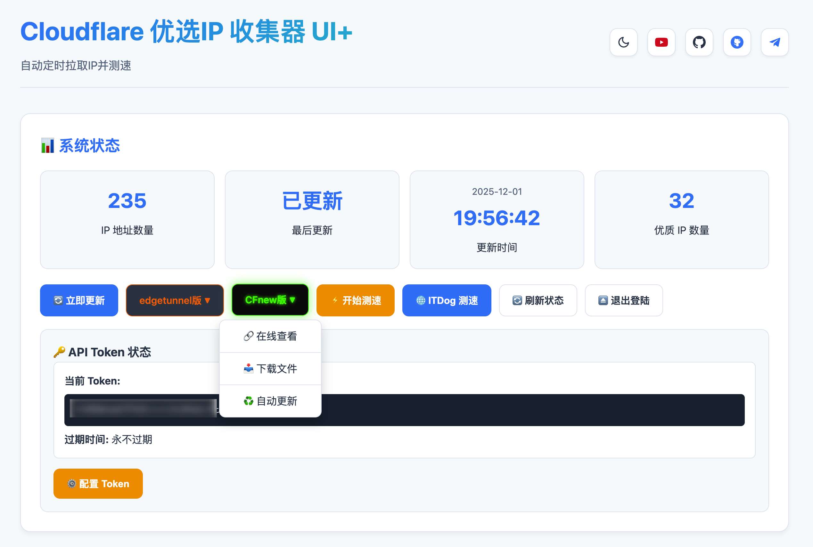
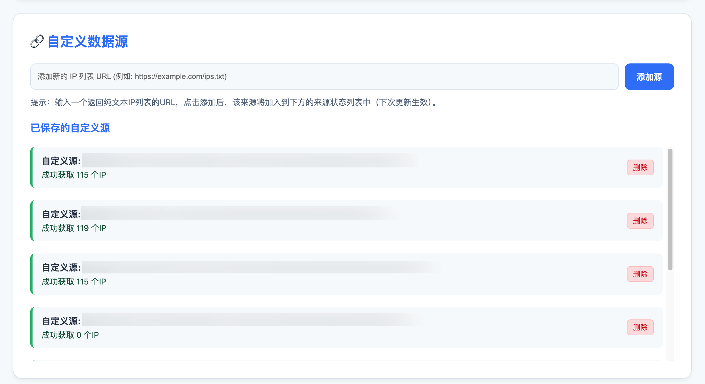
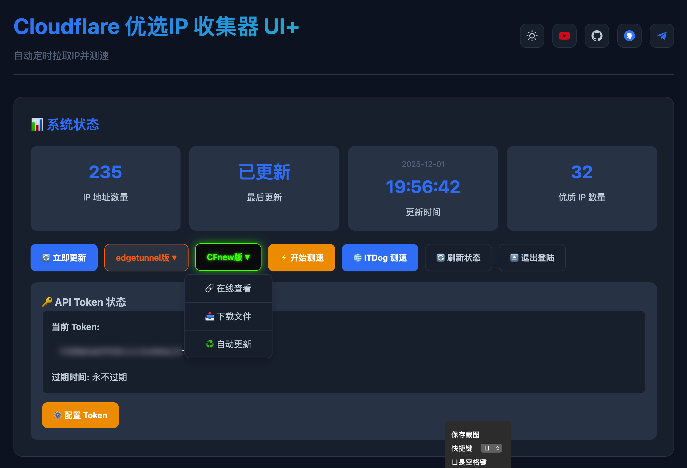
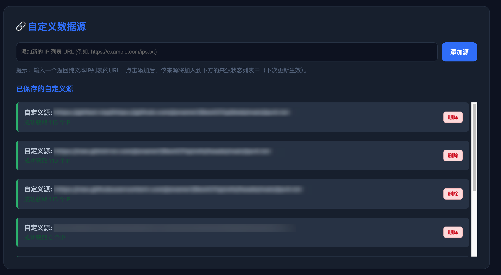

# Cloudflare 优选IP 收集器 UI+
基于好软推荐大神 Cloudflare 优选IP 收集器项目的UI升级版

  
  &nbsp;&nbsp;
  
  &nbsp;&nbsp;
  

一个基于 Cloudflare Workers 的优选 CF IP 地址收集与测速工具，自动从多个公开来源收集 Cloudflare IP 地址，并提供可视化界面和测速功能。
## 🌟 功能特点

- 新增页面明暗：浅色/深色/跟随系统
- 新增自定义数据源
- 新增CFnew版IP输出方式，方便一键复制
- 新增环境变量添加密码，且输出结果url不需要密码，方便引用
- 改变默认edgetunnel输出方式为纯节点，方便结合Sub Store使用
- 更改时间格式为24时制并新增年月日显示
- 增加了Token管理
- 新增CFnew自动更新引用url

